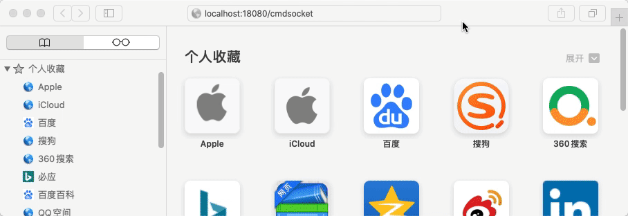

# go_shell_socket
run shell scripts by websocket with go lauguage

## Usage
* pull project
* get [gin](https://github.com/gin-gonic/gin) and [websocket](https://github.com/gorilla/websocket) with `go get`
* config `config.json` file
* build it with `go build`
* open browser with config url and have fun

## Example


## Config

This is config.json which example used. I think it is clear enough. 

```
{
  "port":18080,
  "Cmd_config": {
    "web_url": "/cmdsocket",
    "socket_url": "/ws",
    "cmds": [
      {
        "exec_alias": "ll",
        "cmd": "ls",
        "param": "-l"
      },
      {
        "exec_alias": "shtest",
        "cmd": "sh",
        "param": "test_go_exec.sh"
      },
      {
        "exec_alias": "pinggithub",
        "cmd": "ping",
        "param": "github.com"
      },
      {
        "exec_alias": "cshow",
        "cmd": "cat",
        "param": "config.json"
      }
    ],
    "exit_string": "exit"
  }
}
```

## Important

* This program does not support any text editor such as `vim`.
* It works fin in my macOS Catalina and CentOS 8, and i am not sure about other system.
* `param` in config file will go through to `exec.Command`, so it does not support complicated command. If you want ,put command in shell script and run with `sh`.
* feel free to use it or folk it or issue it. 